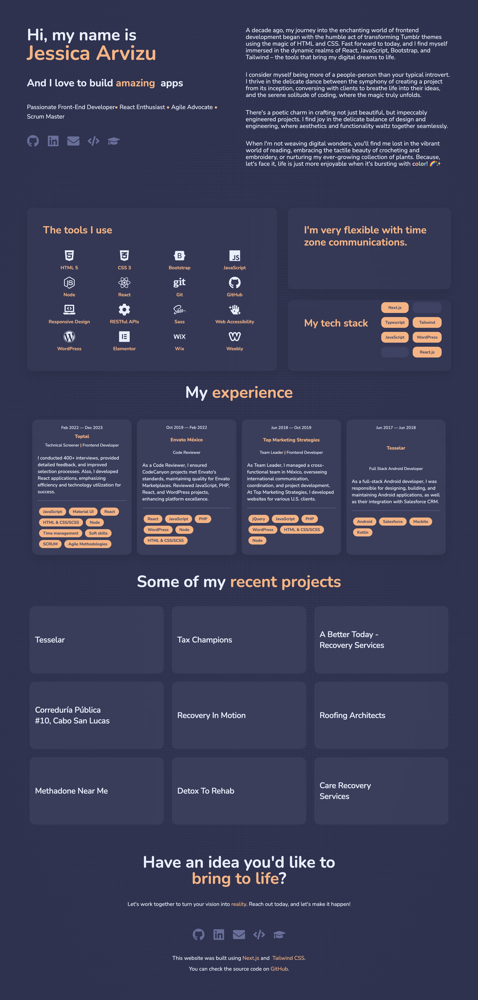

# Jessica Arvizu Portfolio

Welcome to my Front-End Developer Portfolio! This repository serves as a showcase of my work, highlighting my skills in HTML, CSS, JavaScript, and front-end frameworks.

Explore the code to see how I bring creativity to life through seamless and visually appealing web applications. 

From responsive designs to clean code practices, this portfolio reflects my commitment to delivering exceptional user experiences. Join me on this coding journey where innovation meets design.

## Live Site
- [Check out the live site!](www.jessicaarvizu.com)

## Fonts
**Fonts**: [Nunito](https://fonts.google.com/specimen/Nunito)

## Color Reference

| Color Name    | Hex          | Color |
| ------------- |------------- |-------|
| Peach |#ffb17a||
| Very dark desaturated blue |#444769||
| Mostly desaturated dark blue |#676f9d||
| Light grayish blue |#e9edfb||

## Technologies Used

- [Next.js](https://nextjs.org/)
- [Tailwind CSS](https://tailwindcss.com/)
- [Vercel](https://vercel.com/)
- [FontAwesome](https://fontawesome.com/)
- [Aceternity UI](https://ui.aceternity.com/)
- [Framer Motion](https://www.framer.com/motion/)

## Acknowledgements

- [Aceternity UI](https://ui.aceternity.com/)
- [JavascriptMastery](https://www.youtube.com/@javascriptmastery)
- [Readme.so](https://readme.so/es)

## Screenshots

## License

[MIT](https://choosealicense.com/licenses/mit/)

## Deploy on Vercel

The easiest way to deploy your Next.js app is to use the [Vercel Platform](https://vercel.com/new?utm_medium=default-template&filter=next.js&utm_source=create-next-app&utm_campaign=create-next-app-readme) from the creators of Next.js.

Check out our [Next.js deployment documentation](https://nextjs.org/docs/deployment) for more details.
